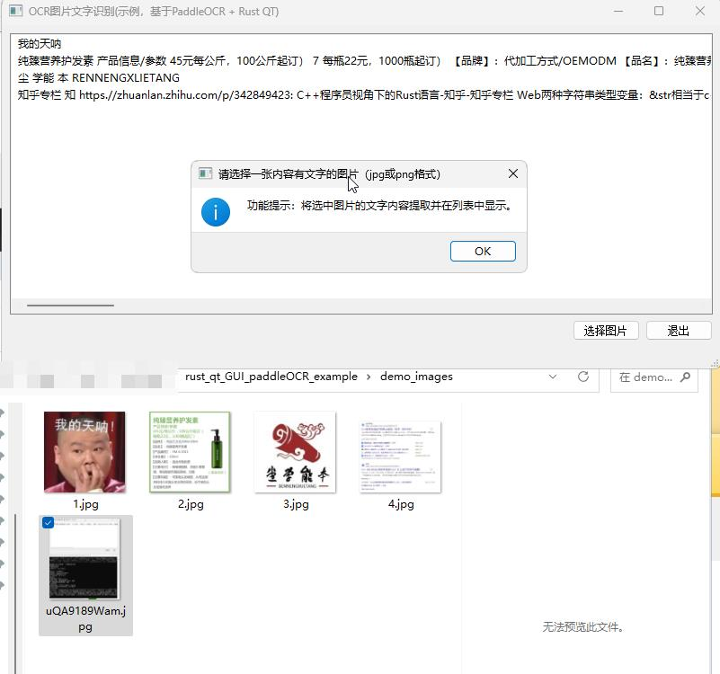

[中文版说明](README.md) / [english README](README.en.md)
## Functionality and Effects
Desktop software for image text recognition (OCR) based on paddleOCR.



Running effect with a debugging interface:


## Source of src/ocr.rs file:

Install the `ruic` tool from https://github.com/jnbooth/ruic
Then
```
cd src/
ruic.exe -o uic.rs --all mainwindow.ui
```
You will get src/uic.rs. Currently, src/uic.rs is already included, so there is no need to execute the above ruic command.


## Note:
1. `ruic.exe` does not support the Line class of QT5. You need to remove duplicate declarations and Line-related declarations in `uic.rs`.
2. Compilation environment requirements: QT 5.14.0 or a version lower than that. Windows 10 system. Rust QT environment on Windows requires the presence of the MSVC compiler, so it is recommended to use the "x64 Native Tools Command Prompt for VS 2017" and navigate to the project directory for cargo operations.
3. Before `cargo build`, make sure to place the files of PaddleOCR-json according to the requirements in "PaddleOCR-json\notes-english.txt".
4. The code in `main.rs` such as `pub type OcrResult = Vec<Root>;` refers to https://gitee.com/toobo/PaddleOCRRust/blob/master/src/entity.rs. Thanks to toobo (ZHao) for the reference!


## How to Compile:
Since the technology stack is based on Rust + Qt 5.14.0 + paddleOCR (C++), it is necessary to use some Rust crate libraries for implementation. The compilation process has been encapsulated in a one-click manner through the build.rs script.
### Compile the test version
```
cargo build
```

### Compile the production version
```
cargo build --release
```

## project url:
1. [gitee](https://gitee.com/kjpioo2006/rust_qt_gui_paddle_ocr_example)
2. [github](https://gitee.com/kerneltravel/rust_qt_gui_paddle_ocr_example)
## License
Apache-2.0