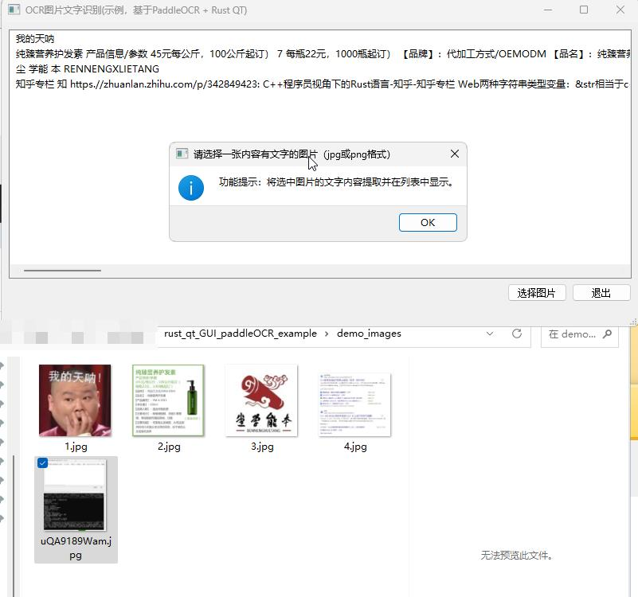
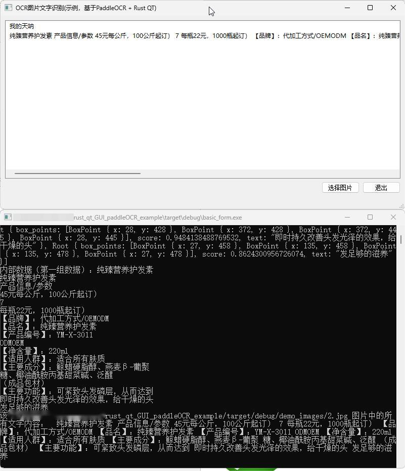

## 功能效果


带调试界面的运行效果：


## 如何编译：

### 编译测试版
```
cargo build
```

### 编译生产版
```
cargo build --release
```

## src/ocr.rs  文件的来源：

安装 ruic 工具，https://github.com/jnbooth/ruic
然后
```
cd src/
ruic.exe -o uic.rs --all mainwindow.ui
```
就会得到src/uic.rs 。目前已包含 src/uic.rs 文件，所以无需执行上述 ruic 命令。


## 注意： 
1. ruic.exe 对 QT5 的Line 类 不支持。需要将uic.rs中重复的声明和 Line 相关的声明删掉。
2. 编译环境要求：qt 5.14.0或低于该版本的qt。windows 10系统。rust qt在windows下的环境要求在有 msvc 编译器的环境，
所以建议使用：打开【适用于 VS 2017 的 x64 本机工具命令提示】后cd到项目目录下进行cargo 操作。
3. 在cargo build 之前，要确保按照 【PaddleOCR-json\说明.txt】 文件的要求放置好  PaddleOCR-json 的文件。
4. main.rs 中 `pub type OcrResult = Vec<Root>;` 等代码参考了 https://gitee.com/toobo/PaddleOCRRust/blob/master/src/entity.rs ，在此向toobo（ ZHao ）表示感谢！


## License
Apache-2.0